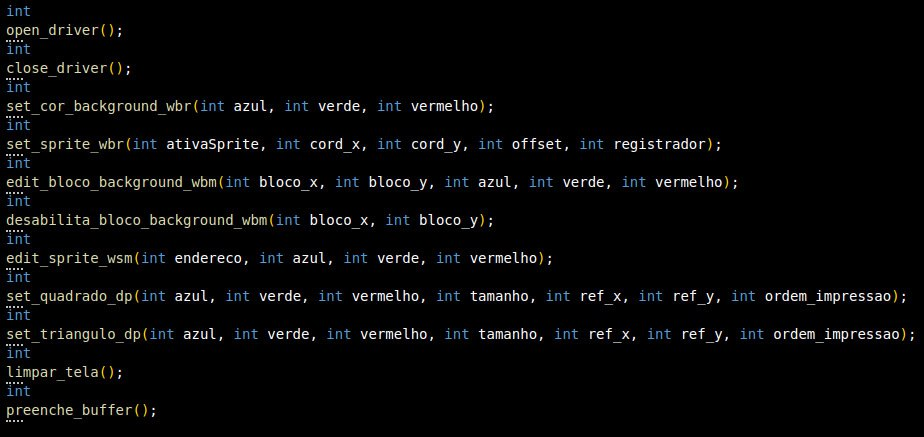

<h1 align="center"> Barramentos</h1>
<h3 align="center"> Desenvolvimento de módulos kernel para realizar a interação entre HPS e processador gráfico utilizando linguagem de programação C </h3>

 

 
<h2> Sobre o Projeto</h2>

O discente Gabriel de Sá Barreto da Universidade Estadual de Feira de Santana (UEFS), desenvolveu em suas atividades de iniciação científica e trabalho de conclusão de curso um processador gráfico que permite o desenho, movimentação e controle de sprites e polígonos convexos (quadrados e triângulos) em um monitor VGA de resolução 680x480 pixels.

Em seu projeto, Gabriel utilizou a plataforma NIOS II para processamento das instruções recebidas, onde a mesma, foi embarcada na mesma FPGA em que estava o processador gráfico. Entretanto, na plataforma de desenvolvimento DE1-SOC, a NIOS II não é necessária devido a presença do processador ARM (HPS). Isto no entanto gera um problema: não existe comunicação entre o processador gráfico implementado na FPGA e o HPS.

Este projeto tem como objetivo resolver este problema desenvolvendo módulos kernel no HPS para o processador gráfico, além de desenvolver uma biblioteca C para facilitar o trabalho do programador no uso dos elementos e funcionalidades disponíveis.

Os requisitos para elaboração do sistema são apresentados a seguir:

* O código carregado na DE1-SoC deve ser feito em linguagem C;
* A biblioteca deve conter no mínimo uma função para cada Instrução do Processador Gráfico;
* Código em linguagem C demostrando a utilização de todos os elementos disponíveis em uma imagem que deve ser transmitida para o monitor CRT através da saída VGA

<h2>  Equipe  </h2>
<uL> 
  <li><a href="https://github.com/LucaasGy">Lucas Gabriel Cerqueira Santos Lima</a></li>
  <li><a href="https://github.com/Lucas-L-Rodrigues">Lucas Lima Rodrigues</a></li>
  <li><a href="https://github.com/felipe-py">Luis Felipe Cunha Silva</a></li>
</ul>

<h1 align="center"> Sumário </h1>

	<ul>
        <li><a href="#equipamentos">  Descrição dos Equipamentos e Software Utilizados</a></li>
        <li><a href="#arq_CPU">  Arquitetura da placa DE1-SoC</a></li>
        <li><a href="#Perifericos-utilizados"> Periféricos da Placa DE1-SoC Utilizados </a></li>
        <li><a href="#Arquitetura GPU"> Arquitetura da GPU utilizada </a></li>
	<li><a href="#Biblioteca uso GPU"> Biblioteca criada para uso da GPU </a></li>
        <li><a href="#testes"> Testes Realizados </a></li>
        <li><a href="#conclusao"> Conclusão </a></li>
        <li><a href="#execucaoProjeto"> Execução do Projeto </a></li>
        <li><a href="#referencias"> Referências </a></li>
	</ul>	

 
<h2> Descrição dos Equipamentos e Software Utilizados</h2>

 

Nesta seção, são apresentados os equipamentos e software utilizados durante o desenvolvimento do projeto.

<h3> O kit de desenvolvimento DE1-SoC</h3>

A placa DE1-SoC é um kit de desenvolvimento que integra um processador ARM Cortex-A9 dual-core com um FPGA Cyclone V da Intel. Este dispositivo oferece uma variedade de periféricos, como display de 7 segmentos, porta Ethernet, USB, porta de áudio, entre outros, tornando-o adequado para projetos que exigem integração de software e hardware.

  

<strong>Kit de desenvolvimento DE1-SoC</strong>

<h3> Monitor CRT</h3>

O monitor DELL m782p foi utilizado para a exibição de testes e imagem final do projeto. Ele possui uma tela de visualização de 17 polegadas e uma resolução máxima de 1280x1024 pixels, além de utilizar a tecnologia CRT, que utiliza tubos de raios catódicos para o seu funcionamento. A saída VGA é a utilizada pelo monitor para a exibição de imagens.

  

<strong>Monitor CRT DELL</strong>

<h3> Linguagem C</h3>

A seleção da linguagem C foi motivada por sua eficiência, portabilidade e ampla adoção em sistemas embarcados. Sua sintaxe direta proporciona um controle preciso sobre o hardware, ao passo que suas bibliotecas padrão e ferramentas simplificam o desenvolvimento de código compacto e otimizado para dispositivos com recursos limitados.

<h3> Compilador GNU</h3>

O GCC, que significa "GNU Compiler Collection" (Coleção de Compiladores GNU), é uma distribuição integrada de compiladores amplamente adotada que suporta diversas linguagens de programação, como C, C++, Objective-C, Fortran, Ada, entre outras. Ao ser executado, o GCC atravessa etapas de pré-processamento, compilação, montagem e ligação. Ele disponibiliza uma vasta variedade de opções de linha de comando para personalização, o que simplifica a configuração de acordo com as necessidades específicas do desenvolvedor.

<h3>Vscode</h3>

O Visual Studio Code, também conhecido como VSCode, é um ambiente de desenvolvimento muito popular. Desenvolvido pela Microsoft, é um editor de código aberto e gratuito que oferece recursos como realce de sintaxe, conclusão automática de código e depuração integrada. Ele suporta uma variedade de linguagens de programação e possui um sistema de extensões que permite personalizar e estender suas funcionalidades. No projeto, o VSCode foi utilizado para desenvolver o código-fonte do jogo e formatar o README.

 
<h2> Arquitetura da placa DE1-SoC</h2>

Nesta seção, será explorado a arquitetura da placa DE1-SoC, incluindo o processador ARM Cortex-A9, a estrutura de registros, a memória utilizada, a comunicação entre o processador e o FPGA, e o processo de compilação nativa na placa.

<h3>Visão Geral dos Recursos do Processador ARM Cortex-A9 </h3>

O processador ARM Cortex-A9 utiliza uma arquitetura de conjunto de instruções reduzido (RISC), com operações aritméticas e lógicas realizadas nos seus registradores de uso geral. O movimento de dados entre a memória e os registradores é feito por instruções Load e Store, utilizando uma palavra de 32 bits e endereçamento de bytes no formato little-endian.

<h3>Estrutura do Registro</h3>

O processador ARM Cortex-A9 possui 15 registros de uso geral (R0 a R14), um contador de programa (R15) e um registro de status de programa atual, CPSR, todos com 32 bits. Dois registros são tratados de maneira especial: R13 é o Stack Pointer e R14 é um registro de link na ligação de sub-rotina.

  

<strong>Registradores disponíveis e sua organização interna</strong>

<h3>Memória</h3>

O HPS inclui uma interface de memória que conecta o ARM MPCORE a uma memória DDR3 de 1 GB. Essa memória é comumente utilizada para armazenamento de programas e dados pelos processadores ARM. A memória é organizada em 256M x 32 bits e pode ser acessada por operações de palavra (32 bits), meia-palavra e byte.

<h3>Mapeamento de Periféricos Implementados</h3>

Os dispositivos implementados na FPGA são acessíveis ao processador ARM através do mapeamento na memória e podem ser acessados usando tanto a ponte HPS-to-FPGA quanto a ponte Lightweight HPS-to-FPGA. Quando um componente da FPGA está conectado a uma dessas pontes, os registradores mapeados
na memória estão disponíveis para leitura e escrita pelo HPS na posição de memória da ponte.

<h3>Diagrama de Blocos do Sistema DE1-SoC</h3>

O sistema DE1-SoC é formado pelo Hard Processor System (HPS) e FPGA dentro do chip Cyclone V. O HPS inclui um processador dual-core ARM Cortex-A9, uma porta de memória DDR3 e dispositivos periféricos. O FPGA implementa dois processadores Intel Nios II e diversas portas periféricas.

  

<strong>Diagrama da arquitetura da placa DE1-SoC</strong>

<h3>Comunicação entre Processador e FPGA via JTAG</h3>

A porta JTAG possibilita a comunicação entre a placa DE1-SoC e o computador host, permitindo a transferência de arquivos de programação FPGA para a placa DE1-SoC e o monitoramento através do programa Intel FPGA Monitor.

<h3>Compilação Nativa na Placa DE1-SoC</h3>

A compilação nativa ocorre quando um programa é compilado em um sistema para rodar na mesma arquitetura do próprio sistema. Neste caso, a compilação nativa de programas pode ser realizada na placa DE1-SoC através da linha de comando do Linux, utilizando sua cadeia de ferramentas de compilação integrada. O comando gcc invoca o GNU C Compiler, um compilador de código aberto amplamente utilizado para compilar programas Linux, já citado anteriormente.

 
<h2> Periféricos da Placa DE1-SoC Utilizados </h2>

A seguir, será feita as descrições gerais dos periféricos utilizados da placa DE1-SoC e seus aspectos mais importantes. A Figura abaixo mostra a placa FPGA, com as indicações dos seus dispositivos que serão citados.

  

<strong> Layout dos periféricos da placa</strong>

<h3>Gigabit Ethernet</h3>

A placa suporta a tecnologia de rede que permite a transmissão de dados a uma velocidade de até 1 gigabit por segundo (Gbps). Além de fornecer alta velocidade, também enterag desempenho confiável em redes locais, permitindo uma comunicação rápida e eficiente entre os dispositivos conectados à rede. 

Existem dois LEDs, LED verde (LEDG) e LED amarelo (LEDY), que representam o status da Ethernet PHY (KSZ9021RNI). A conexão da placa ao Gigabit Ethernet é estabelecida quando o LEDG acende.

<h3>Porta de Saída de Vídeo</h3>

A placa é equipada com uma porta de saída de vídeo com um controlador VGA, que pode ser conectada a qualquer monitor VGA padrão. A saída suporta uma resolução de 680x480, a imagem gerada é derivada de duas fontes principais, um <i>pixel buffer</i> e um <i>character buffer</i>.

 
<h2> Arquitetura da GPU</h2>

Nesta seção, discutiremos a arquitetura da GPU utilizada no projeto, suas especificações e detalhes de funcionamento.

<h3>Introdução</h3>

GPU é uma sigla para Graphics Processing Unit, ou uma unidade de processamento gráfico, que nada mais é do que um circuito eletrônico capaz de realizar cálculos matemáticos em alta velocidade, se destacando em relação à CPU devido a sua eficiência em operações que demandam um alto nível de paralelismo.

Para tarefas que exigem a execução de diferentes funções de forma independente, é comum de se fracionar a carga de trabalho em pequenas execuções que, no caso de uma GPU, podem ser alocados a cada um de seus núcleos.

Em aplicações gráficas como jogos, seu uso é comumente associado ao gerenciamento do processo de renderização e, se utilizando de um conjunto de instruções previamente definidas, mover e controlar elementos gráficos (tal como polígonos e sprites) e o layout do background da tela.

A GPU usada neste projeto possui capacidade de renderizar uma tela de 640 x 480 pixels que será projetada em monitor com o padrão VGA possuindo frequência de 60 quadros por segundo (*QPS* ou *FPS*), podendo projetar nessa tela, além de uma cor de fundo, 2 tipos de polígonos convexos (quadrado e triângulo) ou um conjunto predefinido de sprites (já previamente alocados em memória física).

<h3>Módulos internos</h3>

A GPU possui um conjunto de módulos internos, cada um resposável por uma função específica, sendo necessário o funcionamento conjunto de cada uma dessas estruturas para a geração de um novo quadro (ou *Frame*).

Os módulos presentes nessa GPU, além do decodificador de instrução (cuja função é autoexplicativa) são os seguintes:

  

<strong> Diagrama com os módulos da GPU</strong>

1. Unidade de Controle: uma máquina de estados que controla o processo de leitura, decodificação e execução das instruções recebidas.

1. Banco de Registradores: armazena temporariamente as informações (coordenadas, offset de memória, e um bit de ativação) associadas a cada elemento, 32 ao total, 1 para background e 31 para sprites.

1. Módulo de Desenho: reponsável por gerenciar o processo de desenho dos pixels no monitor VGA.

1. Controlador VGA: responsável por gerar os sinais de sincronização (v sync e h sync) da VGA, além de fornecer as coordenadas x e y do processo de varredura do monitor.

1. Memória de Sprites: armazena o bitmap para cada sprite. (12.800 palavras de 9-bits, 3 bits para cada componente RGB). Cada sprite possui tamanho de 20x20 pixels, ocupando de forma unitária 400 posições de memória.

1. Memória de Background: funcionamento similar a memória de sprites, porém utilizada para modificar pequenas partes do background. Consiste em 4.800 palavras de 9-bits

1. Co-Processador: resposável por gerenciar aconstrução de polígonos convexos do tipo Quadrado e Triângulo (unidades de cálculo são responsáveis por executar as etapas de definição e análise de colinearidade dos polígonos em relação aos pixels da tela.).

1. Gerador RGB: escolhe a cor que será gerada no pixel em caso de haver 2, ou mais, estruturas naquela mesma região (prioridade: sprite → polígono → background)

<h3>Comandos e funções</h3>

<h4>Escrita no Banco de Registradores (WBR):</h4> 

Essa instrução é responsável por configurar os registradores que armazenam as informações dos sprites e a cor base do background. O *opcode* dessa função é 0000.
A primeira forma dessa instrução se dá quando queremos mudar a cor de background, e usa um *opcode* (4 bits) para identificar a operação, o registrador (5 bits, para representar 32 possíveis registradores) que irá guardar a informação da cor do background e em seguida a sequência que indica a cor do background em em RGB (9 bits, 3 para codificar cada cor RGB).

  

<strong> Formato instrução WBR (1)</strong>

A segunda forma da instrução se dá quando queremos manipular algum sprite, continua usando um *opcode*, e um campo de registrador, mas em seguida é passado um *offset* (9 bits) que dará o endereço de memória do sprite a ser configurado, em seguida temos as coordenadas em que o sprite será posto em X e Y (10 bits para cada um, para poder representar as 640 posições verticais), e por fim um bit *sp*, para habilitar/desabilitar o desenho do sprite na tela.

  

<strong> Formato instrução WBR (2)</strong>

<h4>Escrita na Memória de Sprites (WSM):</h4> 

Essa instrução armazena ou modifica o conteúdo presente na Memória de Sprites. O *opcode* dessa função é 0001.
Essa instrução, além do *opcode* (4 bits), possui um campo para inserção do endereço de memória (16 bits, para representar todos so endereços da memória de sprites) seguido por outro campo para os novos valores de cor (9 bits, 3 para cada cor RGB).

  

<strong> Formato instrução WSM</strong>

<h4>Escrita na Memória de Background (WBM):</h4> Essa instrução armazena ou modifica o conteúdo presente na Memória de Background. Sua função é configurar valores RGB para o preenchimento de áreas do background. O *opcode* dessa função é 0010.
Similar a WSM, contudo o endereço de memória conta apenas com 12 bits, devido ao tamanho reduzido da memória de background em comparação a memória de sprites.

<h4>Definição de um Polígono (DP):</h4> 

Essa instrução é utilizada para modificar o conteúdo da Memória de Instrução do Co-Processador, de forma a definir os dados referentes a um polígono que deve ser renderizado. O *opcode* dessa função é 0011.
O campo endereço indica a posição de memória em que a instrução será armazenada (4 bits), em seguida são passadas as coordenadas do ponto de referência para o polígono (9 bits cada), em seguida pelo tamanho do polígono (4 bits, ver a tabela), com a cor do polígono em RGB (9 bits, 3 para cada cor) e o bit de forma que indica se tratar de um quadrado (0), ou triângulo (1).

  

<strong> Formato instrução DP (2)</strong>

  

<strong> Relação numérica do tamanho do polígono</strong>

<h3>Comunicação com a GPU</h3>

Para realizar a comunicação com o processador gráfico são utilizadas duas FIFOs (First In First Out) e um módulo gerador de pulso. O acesso as GPIOs (General-Purpose Input/Output) será feito pelo mapeamento de memória em que são associados determinados endereços de memória as entradas e saídas do sistema, assim garantindo acesso a todos os sinais e barramentos conectados no Nios II (Processador de Propósito geral do sistema) que permite, se fazendo uso de instruções personalizadas, realizar a distribuição dos campos das instruções do processador gráfico dentro dos barramentos “dataA” e “dataB” no momento do envio das informações.

O barramento “dataA” é usado para opcodes e endereçamento do banco de registradores e memórias, enquanto que o barramento “dataB” é usado para o envio de dados a serem armazenados e/ou atualizados.

Com as instruções já devidamente alocadas em seus respectivos barramentos é necessário que o módulo gerador de pulso dê o sinal para permitir a escrita dessas informações nas FIFOs (uma para cada barramento) em um único pulso de clock que imediatamente após o envio da informação irá interromper esse sinal. Esse funcionamento que garante que a informação não será escrita múltiplas vezes enquanto o sistema esteja recebendo energia.

 
<h2> Biblioteca criada para uso da GPU</h2>

Nesta seção, explicaremos todas as funções implementadas em uma biblioteca escrita em linguagem c para facilitar o trabalho do programador na utilização dos artifícios disponíveis na GPU, além de realizar a comunicação com o driver nas situações de escrita e leitura de informações.

<h3>Funções para comunicação com o driver</h3>

Três funções são utlizadas para interligar o driver a biblioteca,são elas:

<h4>Abertura do driver:</h4>

 A primeira delas é a <i>open_driver()</i>, seu objetivo é abrir o arquivo referente ao driver para iniciar a comunicação entre driver e biblioteca, retornando erro caso a abertura do arquivo não se concretize. 
 
 <h4>Fechar driver:</h4>
 
 Para finalizar a comunicação entre o driver e a biblioteca é utilizada a função <i>close_driver()</i>, que encerra a comunicação com o arquuivo referente ao driver retornando erro caso isso não se concretize.

<h4>Transferência de dados entre biblioteca e driver:</h4>

Por fim, a função <i>preenche_buffer()</i> realiza a transferência do buffer contendo as informações dos barramentos <i>data_a</i> e <i>data_b</i> para o driver. São 20 caracteres ao todo, sendo os 10 primeiros referentes ao barramento b e os 10 últimos referentes ao barramento a, os dados são recebidos em decimal e a função é também responsável por converter estes dados em char.

<h3>Funções para utilização da GPU</h3>

Funções para que utilizam os elementos disponibilizados pela GPU forma criadas para facilitar a utilização destes elementos por parte dos progrmadores, a seguir explicaremos cada uma delas em detalhes

<h4>Aplicação de cor ao background:</h4>

A função <i>set_cor_background_wbr()</i>, recebe como parâmetro as cores RGB (vermelho, verde e azul) em sua representação decimal, ela realiza verificações para tratar casos em que o valor recebido é negativo ou maior que 7, intervalo que é incompatível com as especificações da GPU. 

Em caso de valor recebido dentro do intervalo correto (entre 0 e 7) os valores informados serão convertidos em char para serem alocados nos barramentos de instrução <i>data_a</i> e <i>data_b</i> para enfim serem enviados ao driver através da função <i>preenche_buffer()</i>.

<h4>Exibir sprites na tela:</h4>

A função <i>set_sprite_wbr()</i> recebe como parâmetros o bit de ativação do sprite, as coordenadas x e y onde deve estar localizado o sprite, o sprite a ser exibido e o registrador em que le será armazenado. Verificações são feitas para assegurar que o código de ativação do sprite seja igual a 1 e que sua localização na tela respeite os limites pré definidos, que vão de 0 a 679 para x e de 0 a 479 para y. 

É verificado também se o valor que representa o sprite escolhido e o registrador que armazenará ele está dentro do intervalo de 0 a 31, quantidade total de sprites e registradores disponíveis. Por fim, os dados recebidos são atribuidos aos barramentos a e b para enfim serem enviados ao buffer pela função <i>preenche_buffer()</i>.

<h4>Editar background:</h4>

Para realizar a edição do background é utilizada a função <i>edit_bloco_background_wbm()</i>, ela recebe como parâmetros as coordenadas x e y referentes de forma respectiva a linha e coluna onde serão feitas as edições, a nova cor que será alocada e o bloco total de background que será editado, chegamos a este valor total do bloco multiplicando o valor informado em y por 80 (número total de linhas) e somando a x (numero de colunas). 

É verificado se o valor  em bloco está dentro do limite permitido de blocos editáveis na tela, que vai de 0 a 4799 e se o valor que representa cada cor no RGB está dentro do permitido que vai de 0 a 7. Caso as verificações passem os valores são atribuídos aos barramentos para enfim serem levados ao driver por <i>preenche_buffer()</i>.

<h4>Desabilitar background:</h4>

Nos mesmos moldes da função anterior, podemos desabilitar um bloco especifíco do background usando a função <i>desabilita_bloco_background_wbm()</i>, os parâmetros referentes as coordenadas e cálculo do bloco total a ser desabilitado é o mesmo, entretanto, dessa vez não precisamos das cores por estarmos jsutamento apagando o background. As mesmas verificações para o tamanho do bloco e intervalo de valor das coordenadas são usadas, a alocação nos barramentos e escrita no driver é feita da igualmente usando <i>preenche_buffer()</i>.

<h4>Editar sprites:</h4>

<h4>Exibir quadrado:</h4>

Um dos polígonos que a GPU consegue renderizar é o quadrado, para implementar está funcionalidade usamos a função <i>set_quadrado_dp()</i>, ela recebe como parâmetros a cor de criação do quadrado a partir do RGB, o tamanho do quadrado a ser renderizado, a posição que ele deve ocupar na tela e sua ordem de exibição na fila. Como mencionado anteriormente os valores para o RGB devem estar eentre 0 e 7, para o tamanho o intervalo definido vai de 0 a 15, com relação a coordenada x o valor deve estar entre 0 e 511 e entre 0 e 479 para y. 

A ordem de exibição na fila deve respeitar o número máximo de poligonos que podem ser renderizados, podendo ocupar uma posição de 0 a 15. Em caso de sucesso ao passar pelas verificações os barramentos recebem as informações que são enviadas oa driver por <i>preenche_buffer()</i>.

<h4>Exibir triângulo:</h4>

A GPU também consegue realizar a renderização de triângulos, a função criada para realizar esta funcionalidade é a <i>set_triangulo_dp()</i> que funciona nos mesmos moldes da criação dos quadrados, recebendo os mesmos parâmetros e realizando as mesmas verificações, entretanto, o primeiro bit atribuido ao barramento b é colocado igual a 1, indicando para a GPU que um triângulo deve ser renderizado, diferente da criação do quadrado que é indicado com um 0.

<h4>Limpar a tela:</h4>
Uma função foi criada para apagar todos os elementos renderizados pela GPU em uma tela de uma só vez, chamada <i>limpar_tela()</i>. Automaticamente ela zera os atributos do background para apaga-lo, além de remover utilizando laços do tipo for em todos os itens renderizados. 

Para apagar os blocos editados do background, dois laços aninhados percorrem de forma respectiva as linhas e colunas da tela chamando a função <i>desabilita_bloco_background_wbm()</i> explicada anteriomente. Na remoção dos sprites e poligonos os laços funcionam chamando as respectivas funções responsáveis por cada item criado, todos os parâmetros de envio são zerados, a iteração passa por cada registrador para limpar os sprites e por cada posição na fila para desabilitar os polígonos.

<h4>Visualizando as funções</h4>
A seguir, é apresentada a imagem do arquivo de cabeçalho contendo a definição de cada função explicada anteriormente, seus parâmetros e tipagem do retorno de cada uma delas.

  

<strong> Definição de cada uma das funções no arquivo de cabeçalho</strong>

 
<h2> Testes </h2>

A seguir, a descrição dos testes realizados para garantir o adequado funcionamento do driver e biblioteca.

<h3>Driver</h3>

Afim de garantir o funcionamento do carregamento e descarregamento no kernel do linux do driver desenvolvido, além de algumas outras operações, foram realizados alguns testes descritos a seguir.

* Inicializando o módulo kernel.

  

<strong>Carregando o módulo kernel no Linux</strong>

* Removendo o módulo kernel.

  

<strong>Descarregando o módulo kernel no Linux</strong>

* Abrindo comunicação com o dispositivo de caractere.

  

<strong>Abre arquivo especial</strong>

* Fechando comunicação com o dispositivo de caractere.

  

<strong>Fecha arquivo especial</strong>

* Lendo dados do módulo kernel.

  

<strong>Lê buffer do driver</strong>

<h3>Biblioteca + Driver</h3>

Para teste das funções da biblioteca projetada em C, além de verificar sua correta comunicação com o módulo kernel carregado, foi desenvolvimento um código para gerar uma imagem utilizando os elementos fornecidos pela GPU de Gabriel Sá Barreto Alves. Os elementos utilizados e as funções necessárias para conclusão da imagem final serão descritos a seguir.

  

<strong>Imagem Final</strong>

* Céu (azul claro) -> <i>set_cor_background_wbr</i> 1x

* Sol (amarelo) -> <i>set_quadrado_dp</i> e <i>set_triangulo_dp</i> 1x cada

* Nuvens (branco) -> <i>edit_bloco_background_wbm</i> 31x

* Gramas (verde) -> <i>edit_bloco_background_wbm</i> 16x

* Troncos 1 e 2 (azulado) -> <i>set_sprite_wbr</i> 2x

* Árvores 1 e 2 (vermelha) -> <i>set_sprite_wbr</i> 2x

* Aliens 1 e 2 (branco e vermelho) -> <i>set_sprite_wbr</i> 2x

* Maçaneta (barra azul) -> <i>set_sprite_wbr</i> 1x

* Teto da casa (marrom) -> <i>set_triangulo_dp</i> 6x

* Porta da casa (marrom) -> <i>set_quadrado_dp</i> 2x

* Janelas da casa (marrom) -> <i>set_quadrado_dp</i> 2x

* Estrutura da casa (branco) -> <i>set_quadrado_dp</i> 1x

Com o resultado da imagem final, foi possível comprovar a integridade dos dados recebidos e processados pelas funções da biblioteca, além da correta comunicação biblioteca + driver.

<h3>Outros testes</h3>

Também foram realizados testes para verificar a função de remover da tela todos elementos utilizados e as verificações de erros de dados recebidos por parâmetro nas funções. Para os erros, foram testadas as funções <i>set_cor_background_wbr</i>, <i>set_sprite_wbr</i> e <i>set_quadrado_dp</i>.

* Limpando a tela.

  

<strong>Remove da tela elementos utilizados</strong>

* Passando dados inválidos para <i>set_cor_background_wbr</i>.

  

<strong>Função retorna mensagem indicativa ao erro capturado</strong>

* Passando dados inválidos para <i>set_sprite_wbr</i>.

  

<strong>Função retorna mensagem indicativa ao erro capturado</strong>

* Passando dados inválidos para <i>set_quadrado_dp</i>.

  

<strong>Função retorna mensagem indicativa ao erro capturado</strong>

 
<h2> Conclusão</h2>

O desenvolvimento de uma forma de comunicação entre a GPU implementada em uma plataforma FPGA e o HPS foi alcançado de forma satisfatória.

A criação de um driver em linguagem C que atuasse no recebimento de informações do espaço de usuário a partir de uma biblioteca que facilite o trabalho do programador na utilização das funções disponibilizadas pela GPU foi alcançada, e o projeto final com a construção de uma imagem utilizando os elementos disponíveis na GPU através da biblioteca criada foi realizado.

 
<h2> Execução do Projeto  </h2>

Para uso do driver e biblioteca, é necessário seguir os seguintes passos para obter o código-fonte, compilar o código em C, inserir o driver no kernel linux e executá-lo em um dispositivo FPGA DE1-SoC acoplado com a GPU de Gabriel Sá Barreto Alves. Na criação do dispositivo de caractere, é necessário ajustar o major number alocado dinamicamente ao driver pelo kernel. Ademais, também é preciso ajustar o caminho onde os arquivos gerados na compilação do módulo kernel serão armazenados.

**Passo 1: Clonar o Repositório**

Abra o terminal e execute o seguinte comando para obter o código do repositório:

    git clone https://github.com/felipe-py/PBLSD_Barramentos.git

**Passo 1.1: Ajustando major number do dispositivo de caractere**

Caso necessário, na regra "all" do arquivo Makefile, ajuste o major number correspondente ao alocado pelo kernel no momento do carregamento do driver no sistema. O major number corresponde ao "X" mostrado no comando abaixo:

    mknod /dev/driver_tp01_g02 c X 0
  
**Passo 1.2: Ajustando caminho de armazenamento dos arquivos gerados**

Caso necessário, na variável "PWD" do arquivo Makefile, ajuste o caminho referente a onde os arquivos gerados na compilação do driver serão armazenados. Substitua as letras "r","e","t" no comando abaixo, pelo diretório atual:

    PWD := /r/e/t/

**Passo 2: Carregando e configurando driver**

Para compilar, inserir o módulo kernel (driver) e criar um nó de dispositivo de caractere (arquivo especial), use o comando:

    make

**Passo 3: Compilar o Código em C**

Para obter código teste da biblioteca, compile e execute o código usando o comando:

    make run

**Passo 4: Descarregando driver**

Para apagar os arquivos gerados de compilação do módulo, remover o módulo do kernel e seu nó de dispositivo de caractere (arquivo especial), use o comando:

    make clean

Para apagar todos os arquivos do diretório, use o comando:

    make clearAll

