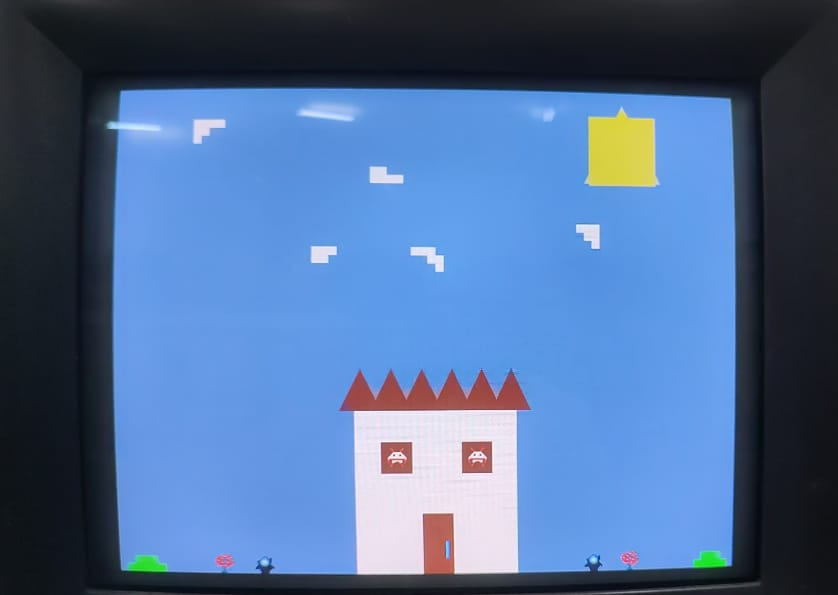

<h1 align="center"> Barramentos</h1>
<h3 align="center"> Desenvolvimento de módulos kernel para realizar a interação entre HPS e processador gráfico utilizando linguagem de programação C </h3>

 

 
<h2> Sobre o Projeto</h2>

O discente Gabriel de Sá Barreto da Universidade Estadual de Feira de Santana (UEFS), desenvolveu em suas atividades de iniciação científica e trabalho de conclusão de curso um processador gráfico que permite o desenho de dois tipos de polígonos convexos (quadrados e triângulos), além de uma determinada quantidade de sprites. Além disso é possível controlar e mover elementos exibidos em um monitor VGA de resolução 680x480 pixels.

Em seu projeto, Gabriel utilizou a plataforma NIOS II para processamento das instruções recebidas, onde a mesma, foi embarcada na mesma FPGA em que estava o processador gráfico. Entretanto, na plataforma de desenvolvimento DE1-SOC, a NIOS II não é necessária devido a presença do processador ARM (HPS). Isto no entanto gera um problema: não existe comunicação entre o processador gráfico implementado na FPGA e o HPS.

Este projeto tem como objetivo resolver este problema desenvolvendo módulos kernel no HPS para o processador gráfico, além de desenvolver uma biblioteca C para facilitar o trabalho do programador no uso dos elementos e funcionalidades disponíveis.

Os requisitos para elaboração do sistema são apresentados a seguir:

* O código carregado na DE1-SoC deve ser feito em linguagem C;
* A biblioteca deve conter no mínimo uma função para cada Instrução do Processador Gráfico;
* Código em linguagem C demostrando a utilização de todos os elementos disponíveis em uma imagem que deve ser transmitida para o monitor CRT através da saída VGA.

<h2>  Equipe  </h2>
<uL> 
  <li><a href="https://github.com/LucaasGy">Lucas Gabriel Cerqueira Santos Lima</a></li>
  <li><a href="https://github.com/Lucas-L-Rodrigues">Lucas Lima Rodrigues</a></li>
  <li><a href="https://github.com/felipe-py">Luis Felipe Cunha Silva</a></li>
</ul>

<h1 align="center"> Sumário </h1>

	<ul>
        <li><a href="#equipamentos">  Descrição dos Equipamentos e Software Utilizados</a></li>
        <li><a href="#arq_CPU">  Arquitetura da placa DE1-SoC
        </a></li>
        <li><a href="#Perifericos-utilizados"> Periféricos da Placa DE1-SoC Utilizados </a></li>
        <li><a href="#Arquitetura GPU"> Arquitetura da GPU</a></li>
        <li><a href="#Driver uso GPU"> Driver para comunicação com a GPU </a></li>
	      <li><a href="#Biblioteca uso GPU"> Biblioteca para uso da GPU </a></li>
        <li><a href="#solucao-geral"> Solução Geral do projeto </a></li>  
        <li><a href="#testes"> Testes</a></li>
        <li><a href="#conclusao"> Conclusão </a></li>
        <li><a href="#execucaoProjeto"> Execução do Projeto </a></li>
        <li><a href="#referencias"> Referências </a></li>
	</ul>	

 
<h2> Descrição dos Equipamentos e Software Utilizados</h2>

 

Nesta seção, são apresentados os equipamentos e software utilizados durante o desenvolvimento do projeto.

<h3> O kit de desenvolvimento DE1-SoC</h3>

A placa DE1-SoC é um kit de desenvolvimento que integra um processador ARM Cortex-A9 dual-core com um FPGA Cyclone V da Intel. Este dispositivo oferece uma variedade de periféricos, como display de 7 segmentos, porta Ethernet, USB, porta de áudio, entre outros, tornando-o adequado para projetos que exigem integração de software e hardware.

  

<strong>Kit de desenvolvimento DE1-SoC</strong>

<h3> Monitor CRT</h3>

O monitor DELL m782p foi utilizado para a exibição de testes e imagem final do projeto. Ele possui uma tela de visualização de 17 polegadas e uma resolução máxima de 1280x1024 pixels, além de utilizar a tecnologia CRT, que utiliza tubos de raios catódicos para o seu funcionamento. A saída VGA é a utilizada pelo monitor para a exibição de imagens.

  

<strong>Monitor CRT DELL</strong>

<h3> Linguagem C</h3>

A seleção da linguagem C foi motivada por sua eficiência, portabilidade e ampla adoção em sistemas embarcados. Sua sintaxe direta proporciona um controle preciso sobre o hardware, ao passo que suas bibliotecas padrão e ferramentas simplificam o desenvolvimento de código compacto e otimizado para dispositivos com recursos limitados.

<h3> Compilador GNU</h3>

O GCC, que significa "GNU Compiler Collection" (Coleção de Compiladores GNU), é uma distribuição integrada de compiladores amplamente adotada que suporta diversas linguagens de programação, como C, C++, Objective-C, Fortran, Ada, entre outras. Ao ser executado, o GCC atravessa etapas de pré-processamento, compilação, montagem e ligação. Ele disponibiliza uma vasta variedade de opções de linha de comando para personalização, o que simplifica a configuração de acordo com as necessidades específicas do desenvolvedor.

<h3>Vscode</h3>

O Visual Studio Code, também conhecido como VSCode, é um ambiente de desenvolvimento muito popular. Desenvolvido pela Microsoft, é um editor de código aberto e gratuito que oferece recursos como realce de sintaxe, conclusão automática de código e depuração integrada. Ele suporta uma variedade de linguagens de programação e possui um sistema de extensões que permite personalizar e estender suas funcionalidades. No projeto, o VSCode foi utilizado para desenvolver o código-fonte do jogo e formatar o README.

 
<h2> Arquitetura da placa DE1-SoC</h2>

Nesta seção, será explorado a arquitetura da placa DE1-SoC, incluindo o processador ARM Cortex-A9, a estrutura de registros, a memória utilizada, a comunicação entre o processador e o FPGA, e o processo de compilação nativa na placa.

<h3>Visão Geral dos Recursos do Processador ARM Cortex-A9 </h3>

O processador ARM Cortex-A9 utiliza uma arquitetura de conjunto de instruções reduzido (RISC), com operações aritméticas e lógicas realizadas nos seus registradores de uso geral. O movimento de dados entre a memória e os registradores é feito por instruções Load e Store, utilizando uma palavra de 32 bits e endereçamento de bytes no formato little-endian.

<h3>Estrutura do Registro</h3>

O processador ARM Cortex-A9 possui 15 registros de uso geral (R0 a R14), um contador de programa (R15) e um registro de status de programa atual, CPSR, todos com 32 bits. Dois registros são tratados de maneira especial: R13 é o Stack Pointer e R14 é um registro de link na ligação de sub-rotina.

  

<strong>Registradores disponíveis e sua organização interna</strong>

<h3>Memória</h3>

O HPS inclui uma interface de memória que conecta o ARM MPCORE a uma memória DDR3 de 1 GB. Essa memória é comumente utilizada para armazenamento de programas e dados pelos processadores ARM. A memória é organizada em 256M x 32 bits e pode ser acessada por operações de palavra (32 bits), meia-palavra e byte.

<h3>Mapeamento de Periféricos Implementados</h3>

Os dispositivos implementados na FPGA são acessíveis ao processador ARM através do mapeamento na memória e podem ser acessados usando tanto a ponte HPS-to-FPGA quanto a ponte Lightweight HPS-to-FPGA. Quando um componente da FPGA está conectado a uma dessas pontes, os registradores mapeados
na memória estão disponíveis para leitura e escrita pelo HPS na posição de memória da ponte.

<h3>Diagrama de Blocos do Sistema DE1-SoC</h3>

O sistema DE1-SoC é formado pelo Hard Processor System (HPS) e FPGA dentro do chip Cyclone V. O HPS inclui um processador dual-core ARM Cortex-A9, uma porta de memória DDR3 e dispositivos periféricos. O FPGA implementa dois processadores Intel Nios II e diversas portas periféricas.

  

<strong>Diagrama da arquitetura da placa DE1-SoC</strong>

<h3>Comunicação entre Processador e FPGA via JTAG</h3>

A porta JTAG possibilita a comunicação entre a placa DE1-SoC e o computador host, permitindo a transferência de arquivos de programação FPGA para a placa DE1-SoC e o monitoramento através do programa Intel FPGA Monitor.

<h3>Compilação Nativa na Placa DE1-SoC</h3>

A compilação nativa ocorre quando um programa é compilado em um sistema para rodar na mesma arquitetura do próprio sistema. Neste caso, a compilação nativa de programas pode ser realizada na placa DE1-SoC através da linha de comando do Linux, utilizando sua cadeia de ferramentas de compilação integrada. O comando gcc invoca o GNU C Compiler, um compilador de código aberto amplamente utilizado para compilar programas Linux, já citado anteriormente.

 
<h2> Periféricos da Placa DE1-SoC Utilizados </h2>

A seguir, será feita as descrições gerais dos periféricos utilizados da placa DE1-SoC e seus aspectos mais importantes. A Figura abaixo mostra a placa FPGA, com as indicações dos seus dispositivos que serão citados.

  

<strong> Layout dos periféricos da placa</strong>

<h3>Gigabit Ethernet</h3>

A placa suporta a tecnologia de rede que permite a transmissão de dados a uma velocidade de até 1 gigabit por segundo (Gbps). Além de fornecer alta velocidade, também enterag desempenho confiável em redes locais, permitindo uma comunicação rápida e eficiente entre os dispositivos conectados à rede. 

Existem dois LEDs, LED verde (LEDG) e LED amarelo (LEDY), que representam o status da Ethernet PHY (KSZ9021RNI). A conexão da placa ao Gigabit Ethernet é estabelecida quando o LEDG acende.

<h3>Porta de Saída de Vídeo</h3>

A placa é equipada com uma porta de saída de vídeo com um controlador VGA, que pode ser conectada a qualquer monitor VGA padrão. A saída suporta uma resolução de 680x480, a imagem gerada é derivada de duas fontes principais, um <i>pixel buffer</i> e um <i>character buffer</i>.

 
<h2> Arquitetura da GPU</h2>

Nesta seção, discutiremos a arquitetura da GPU utilizada no projeto, suas especificações e detalhes de funcionamento.

A GPU usada neste projeto possui capacidade de renderizar uma tela de 640x480 pixels que será projetada em monitor com o padrão VGA possuindo frequência de 60 quadros por segundo (*QPS* ou *FPS*), podendo projetar nessa tela, além de uma cor de fundo, 2 tipos de polígonos convexos (quadrado e triângulo) ou um conjunto predefinido de sprites (já previamente alocados em memória física).

<h3>Módulos internos</h3>

A GPU possui um conjunto de módulos internos, cada um resposável por uma função específica, sendo necessário o funcionamento conjunto de cada uma dessas estruturas para a geração de um novo quadro (ou *Frame*).

Os módulos presentes nessa GPU, além do decodificador de instrução (cuja função é autoexplicativa) são os seguintes:

  

<strong> Diagrama com os módulos da GPU</strong>

1. Unidade de Controle: uma máquina de estados que controla o processo de leitura, decodificação e execução das instruções recebidas.

1. Banco de Registradores: armazena temporariamente as informações (coordenadas, offset de memória, e um bit de ativação) associadas a cada elemento, 32 ao total, 1 para background e 31 para sprites.

1. Módulo de Desenho: responsável por gerenciar o processo de desenho dos pixels no monitor VGA.

1. Controlador VGA: responsável por gerar os sinais de sincronização (v sync e h sync) da VGA, além de fornecer as coordenadas x e y do processo de varredura do monitor.

1. Memória de Sprites: armazena o bitmap para cada sprite. (12.800 palavras de 9-bits, 3 bits para cada componente RGB). Cada sprite possui tamanho de 20x20 pixels, ocupando de forma unitária 400 posições de memória.

1. Memória de Background: funcionamento similar a memória de sprites, porém utilizada para modificar pequenas partes do background. Consiste em 4.800 palavras de 9-bits, logo, 4800 blocos editáveis.

1. Co-Processador: resposável por gerenciar a construção de polígonos convexos do tipo Quadrado e Triângulo (unidades de cálculo são responsáveis por executar as etapas de definição e análise de colinearidade dos polígonos em relação aos pixels da tela).

1. Gerador RGB: escolhe a cor que será gerada no pixel em caso de haver 2, ou mais, estruturas naquela mesma região (prioridade: sprite → polígono → background)

<h3>Instruções do Processador Gráfico</h3>

<h4><b>Escrita no Banco de Registradores (WBR):</b></h4> 

Essa instrução é responsável por configurar os registradores que armazenam as informações dos sprites e a cor base do background. O *opcode* dessa função é 0000.
A primeira forma dessa instrução se dá quando queremos mudar a cor de background, e usa um *opcode* (4 bits) para identificar a operação, o registrador (5 bits, para representar 32 possíveis registradores) que irá guardar a informação da cor do background e em seguida a sequência que indica a cor do background em RGB (9 bits, 3 para codificar cada cor RGB).

  

<strong> Formato instrução WBR (1)</strong>

A segunda forma da instrução se dá quando queremos manipular algum sprite, continua usando um *opcode*, e um campo de registrador, mas em seguida é passado um *offset* (9 bits) que dará o endereço de memória do sprite a ser configurado, em seguida temos as coordenadas em que o sprite será posto em X e Y (10 bits para cada um, para poder representar o limite de resolução 640x480), e por fim um bit *sp*, para habilitar/desabilitar o desenho do sprite na tela.

  

<strong> Formato instrução WBR (2)</strong>

<h4><b>Escrita na Memória de Sprites (WSM):</b></h4> 

Essa instrução armazena ou modifica o conteúdo presente na Memória de Sprites. O *opcode* dessa função é 0001.
Essa instrução, além do *opcode* (4 bits), possui um campo para inserção do endereço de memória (14 bits, para representar todos so endereços da memória de sprites) seguido por outro campo para os novos valores de cor (9 bits, 3 para cada cor RGB).

  

<strong> Formato instrução WSM</strong>

<h4><b>Escrita na Memória de Background (WBM):</b></h4> 

Essa instrução armazena ou modifica o conteúdo presente na Memória de Background. Sua função é configurar valores RGB para o preenchimento de áreas do background. O <i>opcode</i> dessa função é 0010.
Similar a WSM, diferenciado-se apenas na quantidade de bits do campo <i>endereço de memória</i>, que apesar de constar 12 bits no documento da GPU, foi comprovado que possui pelo menos um bit a mais, visto que com 12 bits só seria possível editar 4096 endereços da memória de background e através de testes, foi possível alterar 4800 endereços. O background é dividido em 4800 blocos onde cada endereço na memória de background, corresponde a um bloco. Se um endereço recebe o valor 510, o Módulo de Desenho desabilita o bloco.

<h4><b>Definição de um Polígono (DP):</b></h4> 

Essa instrução é utilizada para modificar o conteúdo da Memória de Instrução do Co-Processador, de forma a definir os dados referentes a um polígono que deve ser renderizado. O *opcode* dessa função é 0011.
O campo endereço indica a posição de memória em que a instrução será armazenada (4 bits), em seguida são passadas as coordenadas do ponto de referência para o polígono (9 bits cada), em seguida pelo tamanho do polígono (4 bits, ver a tabela), com a cor do polígono em RGB (9 bits, 3 para cada cor) e o bit de forma que indica se tratar de um quadrado (0), ou triângulo (1).

  

<strong> Formato instrução DP (2)</strong>

  

<strong> Relação numérica do tamanho do polígono</strong>

<h3>Comunicação com a GPU</h3>

Para realizar a comunicação com o processador gráfico são utilizadas duas FIFOs (First In First Out) e um módulo gerador de pulso. O acesso as GPIOs (General-Purpose Input/Output) será feito pelo mapeamento de memória em que são associados determinados endereços de memória as entradas e saídas do sistema, assim garantindo acesso a todos os sinais e barramentos conectados a um processador de propósito geral, que permite, se fazendo uso de instruções personalizadas, realizar a distribuição dos campos das instruções do processador gráfico dentro dos barramentos *dataA* e *dataB* no momento do envio das informações.

O barramento *dataA* é usado para opcodes e endereçamento do banco de registradores e memórias, enquanto que o barramento *dataB* é usado para o envio de dados a serem armazenados e/ou atualizados.

Com as instruções já devidamente alocadas em seus respectivos barramentos é necessário que o módulo gerador de pulso dê o sinal para permitir a escrita dessas informações nas FIFOs (uma para cada barramento) em um único pulso de clock que imediatamente após o envio da informação irá interromper esse sinal. Esse funcionamento que garante que a informação não será escrita múltiplas vezes enquanto o sistema esteja recebendo energia.

 
<h2> Driver para comunicação com a GPU</h2>

Aqui discutiremos sobre o driver desenvolvido e implementado para o projeto. Graças a ele, a comunicação entre a GPU (hardware) e as solicitações feitas a ela (software), é possível. Importante destacar que esse driver foi desenvolvido em conjunto com a biblioteca do projeto, e que apesar de ser possível de ser manipulado por outras bibliotecas é ideal que sejam usados em conjunto.

<h3>Mapeamento de memória</h3>

O driver é destinado, além de suas outras muitas utilidades, ao mapeamento de memória do HPS para ter acesso à FPGA, onde a GPU utilizada está embarcada.

O processador ARM pode acessar a FPGA usando tanto a ponte HPS-to-FPGA quanto a ponte Lightweight HPS-to-FPGA. Logo, este mapeamento é realizado, acessando o espaço de memória da ponte Lightweight HPS-to-FPGA (lwhps2fpga) e se comunicando com a FPGA, onde os registradores mapeados na memória estão disponíveis para leitura e escrita pelo HPS na posição de memória da ponte.

  

<strong> Diagrama das pontes da FPGA</strong>

Com isso, para acessar os barrementos e sinais da GPU, afim de ler e enviar dados para os mesmos, o mapeamento desta ponte é essencial. Com os endereços da ponte e dos deslocamentos necessários para acessar os registradores da GPU em mãos, foram definidos alguns valores, em hexadecimal, que representam cada um:

<b>LW_BRIDGE_BASE</b> que define o endereço físico base da <i>Lightweight HPS-to-FPGA Bridge</i>, citada anteriormente;

<b>LW_BRIDGE_SPAN</b> que define o comprimento em bytes da região de memória a ser mapeada;

<b>lw_virtual</b> é o endereço virtual que mapeia para o início do espaço de endereço físico citado anteriormente (*LW_BRIDGE_BASE*). Ao somar esse endereço virtual com determinados deslocamentos, o endereço de memória dos barramentos e sinais da GPU é alcançado.

<b>DATA_A</b>, <b>DATA_B</b>, <b>WRREG</b> e <b>WRFULL</b> contém os valores de deslocamento para os barramentos e sinais da GPU: <i>DATA_A</i>,  <i>DATA_B</i>, <i>WRREG</i> e <i>WRFULL</i>, sendo <i>DATA_A</i> e  <i>DATA_B</i> referente aos barramentos <i>A</i> e <i>B</i> de dados dos buffers de instruções; <i>WRREG</i> o sinal de escrita no buffer de instrução; e <i>WRFULL</i> o sinal que informa se o buffer de instrução está cheio ou não. 

Os valores estão descritos abaixo:

*LW_BRIDGE_BASE: 0xFF200000*

*LW_BRIDGE_SPAN: 0x100*

*DATA_A: 0x80*

*DATA_B: 0x70*

*WRREG: 0xc0*

*WRFULL: 0xb0*

<h3>Driver de caractere</h3>

Foi decidido a implementação de um dirver de caractere, pois a quantidade de dados a serem manipulados é baixa e sequencial, além dos dados transferidos serem diretamente entre o dispositivo e a memória. Drivers de caractere tendem a ser mais simples de implementar e podem ter menor sobrecarga em termos de recursos do sistema. Eles são eficientes para dispositivos que não necessitam de buffering extenso ou de acesso aleatório aos dados, que é exatamente as características do projeto.

<h3>Detalhamento</h3>

Aqui cabe destacar que o driver nada mais é do que um *Kernel Module*, ou seja, é um arquivo que contém um código que é feito para estender uma funcionalidade do Kernel em tempo de execução, sendo carregado e descarregado conforme a necessidade.
As funções implementadas garantem que o dispositivo possa ser aberto, fechado, lido e escrito de forma controlada e segura, exibindo mensagens apropriadas para indicar o status de cada operação.

O driver se utiliza de duas estruturas (ou “structs”) , sendo elas: “dev_data” para identificar a partir do seu número (“devnum”) o dispositivo, bem como seu tipo (no caso, um “character device”), e *file_operations* que define as operações que podem ser realizadas no dispositivo, associando as funções de abertura, fechamento, leitura e escrita ao módulo proprietário.

São definidos um total de 4 ponteiros aqui também, sendo um para cada endereço descrito em “Mapeamento de memória”: *DATA_A*, *DATA_B*, *WRREG* e *WRFULL*. Cabe apenas um pequeno destaque, de que como são ponteiros suas funções serão apenas armazenar os endereços de cada registrador para serem acessados e alterados conforme a necessidade.

Ademais, foram criadas 2 variáveis globais, sendo:  *ret* com a finalidade de receber o retorno de certas funções; e *buffer_nucleo* que recebe uma sequência de 21 caracteres, usado na comunicação entre o *Kernel space* e o *User space*.

<h3>Operações</h3>

Adiante, serão descritas as operações presentes no driver e como elas funcionam.

<h4><b>dev_init (Inicializa o módulo):</b></h4> 

Aloca dinamicamente um número de dispositivo de caractere (major number), ou seja, permite que o kernel determine um número disponível no momento. Inicializa a estrutura “cdev”, responsável por associar as operações definidas no driver, e realiza o mapeamento com a ponte. Os ponteiros citados anteriormente, são associados a seus respectivos endereços mapeados, e se qualquer etapa falhar, mensagens de erro são exibidas e a inicialização é interrompida (caso contrário, uma mensagem de sucesso é exibida).
	
<h4><b>dev_exit (Encerra o módulo):</b></h4>

O mapeamento da memória é desfeito, o registro do dispositivo de caractere é excluído e o número de dispositivo alocado é liberado Por fim uma mensagem indicando o encerramento do módulo é exibida.

<h4><b>dev_open (Abre o módulo):</b></h4>

Quando o arquivo do dispositivo é aberto, essa função é chamada. Ela simplesmente exibe uma mensagem informando que o dispositivo foi aberto com sucesso.

<h4><b>dev_close (Fecha o dispositivo):</b></h4>

Quando o arquivo do dispositivo é fechado, essa função é chamada. Assim como na abertura, ela exibe uma mensagem indicando que o dispositivo foi fechado com sucesso.

<h4><b>dev_read (Lê o dispositivo):</b></h4>

Esta função é responsável por copiar dados do buffer do núcleo para o buffer do usuário. Se a cópia falhar, uma mensagem de erro é exibida e retorna quantos bytes não foram copiados. Caso contrário, uma mensagem de sucesso é exibida.

<h4><b>dev_write (Escreve no dispositivo):</b></h4>

A função de escrita copia dados do buffer do usuário para o buffer do núcleo. Os dados do buffer do núcleo são então convertidos em inteiros sem sinal de 32 bits e enviados para os barramentos *DATA_A* e *DATA_B*.

A conversão dos dados é feita utilizando-se de um loop para construir dois números inteiros sem sinal, um para o barramento *A* e outro para o *B*, a partir de uma sequência de caracteres numéricos recebidas do buffer do usuário.
Cada iteração do loop multiplica o valor atual das variáveis por 10 (deslocando os dígitos para
a esquerda - inteiro decimal) e adiciona o valor do próximo dígito, convertendo-o de caractere
para número. Isso resulta na construção de um número inteiro a partir dos caracteres sequenciais
no buffer. No sistema de codificação ASCII, os caracteres numéricos '0' a '9' são representados
por valores consecutivos (48 a 57). Subtraindo o valor ASCII do caractere '0' (que é 48) do valor
ASCII de outro caractere numérico, obtemos o valor numérico correspondente.
Por exemplo, '9' - '0' = 57 - 48 = 9.

Ademais, um sinal é enviado indicando que as instruções enviadas devem ser escritas nas FIFO’s. Se qualquer etapa falhar, uma mensagem de erro é exibida, caso contrário uma mensagem de sucesso é exibida.

É importante salientar que é utilizado uma verificação usando o sinal *wrfull*, para verificar se as FIFO’s alcançaram o limite máximo de instruções armazenadas. Ela conta com um loop que dura até que as FIFO’s liberem espaço para receber novas instruções. Desta forma, instruções a serem enviadas não saõ “perdidas”.

 
<h2> Biblioteca para uso da GPU</h2>

Nesta seção, explicaremos todas as funções implementadas em uma biblioteca escrita em linguagem C para facilitar o trabalho do programador na utilização dos artifícios disponíveis na GPU, além de realizar a comunicação com o driver nas situações de escrita e leitura de informações.

<h3>Variáveis globais</h3>

Quatro variáveis são criadas para serem utilizadas entre as funções presentes na biblioteca. São elas:

<h4><i>data_a</i> e <i>data_b</i>:</h4>

Essas variáveis são números inteiros sem sinal de 32 bits que representam os dados a serem enviados para o driver para os barramentos *data_a* e *data_b* da GPU. Essas variáveis são acessíveis e editadas pelas funções da biblioteca a depender dos dados recebidos por parâmetro.

<h4><i>fd</i>:</h4>

Essa variável representa um identificador único do arquivo do dispositivo de caractere do driver.

<h4><i>buffer_user</i>:</h4>

Essa variável representa o buffer da biblioteca, onde serão guardados os dados a serem enviados ao buffer do driver. Como cada barramento (A e B) localizado na GPU suportam 32 bits cada, o maior número inteiro sem sinal que eles suportam é (2^32) - 1 = 4.294.967.295, ou seja, um número de 10 dígitos máximo.

Assim, as posições 0 a 9 desse buffer, irão conter os 10 dígitos de um número inteiro sem sinal para o barramento b e as posições 10 a 19 irão conter os 10 dígitos de um número inteiro sem sinal para o barramento a. É definido o tamanho de 21 para evitar possíveis estouros de array.

<h3>Funções para comunicação com o driver</h3>

Três funções são utlizadas para interligar a biblioteca ao driver. São elas:

<h4><b>Abertura do driver:</b></h4>

 A primeira delas é a <i>open_driver()</i>. Seu objetivo é acessar o dispositivo de caractere atribuído ao driver para iniciar a comunicação entre driver e biblioteca, sendo possível a transferência de dados do espaço de usuário para o espaço de núcleo, retornando erro caso o acesso ao dispositivo não se concretize. 
 
 <h4><b>Fechar driver:</b></h4>
 
 Para finalizar a comunicação entre o driver e a biblioteca é utilizada a função <i>close_driver()</i>. Ela é responsável por encerrar a comunicação com o dispositivo de caractere atribuído ao driver, retornando erro caso isso não se concretize.

<h4><b>Transferência de dados entre biblioteca e driver:</b></h4>

Por fim, a função <i>preenche_buffer()</i> realiza a transferência dos dados do buffer da biblioteca para o buffer do driver. A função converte e transforma em caracteres char, os números inteiros sem sinal de 32 bits das variáveis globais <i>data_a</i> e <i>data_b</i>. Caso o número armazenado seja menor que 10 dígitos, a função adiciona zeros a frente do número afim de completar os 10 caracteres por barramento. Segue imagem exemplificando como ficaria o buffer após essas operações.

  

<strong> Exemplo do buffer após formatações</strong>

Após formatar e preencher o buffer da biblioteca com os dados a serem enviados para o driver, é chamada a função <i>write</i> que envia o descritor do dispositivo de caractere, o buffer da biblioteca e seu tamanho em bytes, retornando um valor diferente de 0, caso isso não se concretize.

<h3>Funções para utilização da GPU</h3>

Funções para utilização e controle dos elementos disponibilizados pela GPU foram criadas. A seguir explicaremos cada uma delas em detalhes.

<h4><b>Aplicação de cor ao background:</b></h4>

A função <i>set_cor_background_wbr()</i>, recebe como parâmetro as cores RGB (vermelho, verde e azul) em sua representação decimal. Ela realiza verificações para tratar casos em que os valores recebidos são negativos ou maiores que 7, intervalo que é incompatível com as especificações da GPU. 

No caso de valores recebidos dentro do intervalo permitido (entre 0 e 7), os valores informados serão convertidos em números inteiros sem sinais de 32 bits para as variáveis globais <i>data_a</i> e <i>data_b</i>, através da junção das operações de deslocamento de bits e a operação "OR". 

O <i>data_a</i> recebe o valor 0, referente ao registrador e o opcode utilizado na GPU para esta instrução.

O <i>data_b</i> recebe os parâmetros referentes a tonalidade da cor a ser setada no background.

Por fim é chamada a função <i>preenche_buffer()</i> para enviar os dados atualizados ao driver. 

<h4><b>Exibir sprites na tela:</b></h4>

A função <i>set_sprite_wbr()</i> recebe como parâmetro o bit de ativação do sprite, as coordenadas x e y onde deve ser exibido o sprite em tela, o sprite a ser exibido e o registrador em que ele será armazenado, todos esses em sua representação decimal. Verificações são feitas para assegurar que o código de ativação do sprite seja igual a 0 ou 1 e que sua localização na tela respeite os limites suportados pela GPU, que vão de 0 a 639 para x e de 0 a 479 para y. 

É verificado também se o valor que representa o sprite escolhido e o registrador que armazenará ele está dentro do intervalo de 0 a 31 e 1 a 31, respectivamente, representando a quantidade total de sprites e registradores disponíveis para armazenamento.

No caso dos valores recebidos estarem dentro dos intervalos permitidos, eles são convertidos em números inteiros sem sinais de 32 bits para as variáveis globais <i>data_a</i> e <i>data_b</i>, através da junção das operações de deslocamento de bits e a operação "OR". 

O <i>data_a</i> recebe o parâmetro referente ao registrador para armazenar o sprite e o opcode utilizado na GPU para esta instrução.

O <i>data_b</i> recebe o restante dos parâmetros recebidos pela função.

Por fim é chamada a função <i>preenche_buffer()</i> para enviar os dados atualizados ao driver.

A seguir, a exibição da sequência de sprites atuais armazenados na memória de dados da GPU, na ordem de visualização da esquerda para a direita, e de cima para baixo. O primeiro sprite é representado por 0 e o último por 24.

  

<strong> Sprites disponíveis atualmente na memória de dados</strong>

<h4><b>Editar background:</b></h4>

Para realizar a edição do background é utilizada a função <i>edit_bloco_background_wbm()</i>. Ela recebe como parâmetro as coordenadas x e y, referentes de forma respectiva a coluna e linha de um bloco do background a ser editado, além da nova cor que será alocada a este bloco, todos esses em sua representação decimal. No escopo da função, é criada uma variável que representa o bloco do background que será editado. Ela armazena o resultado do valor da coordenada y recebida (linha) multiplicado por 80 (número total de colunas), somado a coordenada x recebida (coluna). Esse cálculo resulta em um dos 4800 blocos que compõem o blackground.

É verificado se o valor da variável está dentro do limite permitido de blocos editáveis do background, que vai de 0 a 4799, e se o valor que representa cada cor no RGB está dentro do permitido que vai de 0 a 7.

No caso dos valores recebidos estarem dentro dos intervalos permitidos, eles são convertidos em números inteiros sem sinais de 32 bits para as variáveis globais <i>data_a</i> e <i>data_b</i>, através da junção das operações de deslocamento de bits e a operação "OR". 

O <i>data_a</i> recebe a variável que indica um dos blocos a ser editado e o opcode utilizado na GPU para esta instrução.

O <i>data_b</i> recebe os parâmetros referentes a tonalidade da cor a ser setada no bloco do background.

Por fim é chamada a função <i>preenche_buffer()</i> para enviar os dados atualizados ao driver. 

<h4><b>Desabilitar background:</b></h4>

Nos mesmos moldes da função anterior, podemos desabilitar um bloco especifíco do background usando a função <i>desabilita_bloco_background_wbm()</i>. Os parâmetros referentes as coordenadas e cálculo do bloco a ser desabilitado são os mesmos, entretanto, dessa vez não é preciso das cores RGB por estarmos justamente desabilitando um bloco do background, que por definição da arquitetura da GPU, passando o valor 510, os pixels da area do bloco desabilitado são ocupados com a cor base do background, um polígono ou sprite, caso suas coordenadas coincidam. 

As mesmas verificações para limite permitido de blocos editáveis do background são usadas.

No caso dos valores recebidos estarem dentro dos intervalos permitidos, eles são convertidos em números inteiros sem sinais de 32 bits para as variáveis globais <i>data_a</i> e <i>data_b</i>, através da junção das operações de deslocamento de bits e a operação "OR". 

O <i>data_a</i> recebe a variável que indica um dos blocos a ser desabilitado e o opcode utilizado na GPU para esta instrução.

O <i>data_b</i> recebe o valor especificado na arquitetura da GPU para desabilitar um bloco do background.

Por fim é chamada a função <i>preenche_buffer()</i> para enviar os dados atualizados ao driver. 

<h4><b>Editar sprites:</b></h4>

Para realizar a edição dos sprites armazenados ou criação de novos, é utilizada a função <i>edit_sprite_wsm()</i>. Ela recebe como parâmetro um endereço que se refere ao pixel a ser editado ou criado de um sprite e as cores RGB que esse pixel vai receber, todos esses em sua representação decimal. Verificações são feitas para assegurar que o endereço represente um número presente no intervalo da memória de sprites e se o valor que representa cada cor no RGB está dentro do permitido.

No caso dos valores recebidos estarem dentro dos intervalos permitidos, eles são convertidos em números inteiros sem sinais de 32 bits para as variáveis globais <i>data_a</i> e <i>data_b</i>, através da junção das operações de deslocamento de bits e a operação "OR". 

O <i>data_a</i> recebe o parâmetro referente ao endereço para editar ou criar um pixel de um sprite e o opcode utilizado na GPU para esta instrução.

O <i>data_b</i> recebe os parâmetros referentes a tonalidade da cor a ser setada no pixel do sprite.

Por fim é chamada a função <i>preenche_buffer()</i> para enviar os dados atualizados ao driver. 

<h4><b>Exibir quadrado:</b></h4>

Um dos polígonos que a GPU consegue renderizar é o quadrado. Para implementar está funcionalidade usamos a função <i>set_quadrado_dp()</i>, que recebe como parâmetro a cor de criação do quadrado a partir do RGB, o tamanho do quadrado a ser renderizado, a posição das coordenadas x e y que ele deve ocupar na tela e sua ordem de exibição na fila,  todos esses em sua representação decimal. Como mencionado anteriormente os valores para o RGB devem estar entre 0 e 7. Para o tamanho, o intervalo definido vai de 0 a 15, e em relação a coordenada x o valor deve estar entre 0 e 511 e entre 0 e 479 para coordenada y. A ordem de exibição na fila deve respeitar o número máximo de poligonos que podem ser renderizados em um frame, podendo ocupar uma posição de 0 a 15.

É verificado também, se os valores das coordenadas x e y estão dentro do limite da tela permitido a depender do tamanho escolhido. Por exemplo, caso o tamanho 1 do polígono seja escolhido (20x20 pixels) e as coordenadas x e y forem 9 e 9, o polígono é impresso na tela além dos limites permitidos de 512x480. Dessa forma, ocorre um erro nativo da arquitetura da GPU, em que os polígonos se deformam por toda a tela. Assim, o valor das coordenadas x e y não podem ser menores ou iguais ao tamanho do polígono dividido por 2 menos 1. Aproveitando do exemplo citado neste parágrafo, tamanho 1 = 20x20, logo (20/2) - 1 = 9, ou seja, um limite inválido para polígonos de tamanho 1, seriam valores de x e y menores ou iguais a 9. Caso o tamanho do polígono seja 0, a verificação de limite não é feita.

No caso dos valores recebidos estarem dentro dos intervalos permitidos, eles são convertidos em números inteiros sem sinais de 32 bits para as variáveis globais <i>data_a</i> e <i>data_b</i>, através da junção das operações de deslocamento de bits e a operação "OR". 

O <i>data_a</i> recebe o parâmetro referente a ordem de impressão em tela, possibilitando o controle da sobreposição dos polígonos e o opcode utilizado na GPU para esta instrução.

O <i>data_b</i> recebe o restante dos parâmetros recebidos pela função, além do valor pré definido referente ao tipo de polígono a ser renderizado, neste caso, o valor 0 que representa um quadrado.

Por fim é chamada a função <i>preenche_buffer()</i> para enviar os dados atualizados ao driver.

<h4><b>Exibir triângulo:</b></h4>

A GPU também consegue realizar a renderização de triângulos. A função criada para realizar esta funcionalidade é a <i>set_triangulo_dp()</i>, que funciona nos mesmos moldes da criação dos quadrados, recebendo os mesmos parâmetros e realizando as mesmas verificações. Entretanto, o valor pré definido referente ao tipo de polígono a ser rendereziado é alterado para 1, indicando para a GPU que um triângulo deve ser renderizado, diferente da criação do quadrado que é indicado com um 0.

<h4><b>Limpar a tela:</b></h4>

Uma função foi criada para apagar todos os elementos renderizados pela GPU em uma tela de uma só vez, chamada <i>limpar_tela()</i>. Automaticamente ela atribui a cor nula ao background para apagá-lo, além de desabilitar, utilizando de loops, todos os sprites e polígonos renderizados. O loop passa por cada registrador para desativar os sprites e por cada posição na memória de instrução para desabilitar os polígonos, definindo seus tamanhos como 0. 

Para apagar os blocos editados do background, dois laços aninhados percorrem de forma respectiva as linhas e colunas da tela chamando a função <i>desabilita_bloco_background_wbm()</i> explicada anteriomente, desabilitando todos os 4800 blocos.

<h4><b>Visualizando as funções</b></h4>

A seguir, é apresentada a imagem do arquivo de cabeçalho contendo a definição de cada função explicada anteriormente, seus parâmetros e tipagem do retorno de cada uma delas.

  

<strong> Definição de cada uma das funções no arquivo de cabeçalho</strong>

 
<h2> Solução Geral do projeto </h2>

A solução abrangente deste projeto reflete sua total capacidade de atender a todos os requisitos especificados. O primeiro passo, é carregar o módulo kernel desenvolvido no Linux, afim da comunicação com os barramentos e sinais da GPU, ser possível.

Uma vez carregado, o segundo passo é criar um dispositivo de caractere para interagir com o módulo kernel carregado (driver de dispositivo), fazendo assim, a comunicação do espaço de usuário com o espaço de núcleo.

A partir disso, a função de abertura da biblioteca deve ser chamada para iniciar a comunicação da biblioteca com o dispositivo de caractere devidamente criado.

Com o êxito de todos esses passos, resta somente a utilização das funções disponíveis para uso na biblioteca. Com a utilização das mesmas, foi possível criar uma imagem que será detalhada na próxima seção.

Após a utilização da biblioteca, é preciso chamar a função de encerramento, afim de finalizar a comunicação com o dispositivo de caractere.

Por se tratar de um módulo kernel, após a utilização do mesmo, é necessário descarregá-lo do kernel do Linux e excluir o dispositivo de caractere criado.

Para melhor compreensão da explicação, fornecemos o seguinte diagrama de fluxo detalhando os passos descritos na solução geral.

  

<strong> Fluxograma da solução geral do problema</strong>

 
<h2> Testes </h2>

A seguir, a descrição dos testes realizados para garantir o adequado funcionamento do driver e biblioteca.

<h3>Driver</h3>

Afim de garantir o correto carregamento e descarregamento no kernel do Linux do driver desenvolvido, além de algumas outras operações, foram realizados alguns testes descritos a seguir.

* Inicializando o módulo kernel.

  

<strong>Carregando o módulo kernel no Linux</strong>

* Removendo o módulo kernel.

  

<strong>Descarregando o módulo kernel do Linux</strong>

* Abrindo e fechando comunicação com o dispositivo de caractere.

  

<strong>Abre e fecha o arquivo especial</strong>

<h3>Biblioteca + Driver</h3>

Para teste das funções da biblioteca projetada em C, além de verificar sua correta comunicação com o módulo kernel carregado, foi desenvolvimento um código para gerar uma imagem utilizando os elementos fornecidos pela GPU de Gabriel Sá Barreto Alves. Os elementos utilizados e as funções necessárias para conclusão da imagem final serão descritos a seguir.

  

<strong>Imagem Final</strong>

* Céu (azul claro) -> <i>set_cor_background_wbr</i> 1x

* Sol (amarelo) -> <i>set_quadrado_dp</i> e <i>set_triangulo_dp</i> 1x cada

* Nuvens (branco) -> <i>edit_bloco_background_wbm</i> 31x

* Gramas (verde) -> <i>edit_bloco_background_wbm</i> 16x

* Troncos 1 e 2 (azulado) -> <i>set_sprite_wbr</i> 2x

* Árvores 1 e 2 (vermelha) -> <i>set_sprite_wbr</i> 2x

* Aliens 1 e 2 (branco e vermelho) -> <i>set_sprite_wbr</i> 2x

* Maçaneta (barra azul) -> <i>set_sprite_wbr</i> 1x

* Teto da casa (marrom) -> <i>set_triangulo_dp</i> 6x

* Porta da casa (marrom) -> <i>set_quadrado_dp</i> 2x

* Janelas da casa (marrom) -> <i>set_quadrado_dp</i> 2x

* Estrutura da casa (branco) -> <i>set_quadrado_dp</i> 1x

Com o resultado da imagem final, foi possível comprovar a integridade dos dados recebidos e processados pelas funções da biblioteca, além da correta comunicação biblioteca + driver.

<h3>Outros testes</h3>

Também foram realizados testes para verificar a função de remover da tela todos elementos utilizados e as verificações de erros de dados recebidos por parâmetro nas funções. Para os erros, foram testadas as funções <i>set_cor_background_wbr</i>, <i>set_sprite_wbr</i> e <i>set_quadrado_dp</i>.

* Limpando a tela.

  

<strong>Remove da tela elementos utilizados</strong>

* Passando *vermelho* maior que o permitido para <i>set_cor_background_wbr</i>.

  

<strong>Função retorna mensagem indicativa ao erro capturado</strong>

* Passando <i>offset</i> menor que o permitido para <i>set_sprite_wbr</i>.

  

<strong>Função retorna mensagem indicativa ao erro capturado</strong>

* Passando <i>ref_x</i> e <i>ref_y</i> menor que o permitido de <i>tamanho</i> 1 para <i>set_quadrado_dp</i>.

  

<strong>Função retorna mensagem indicativa ao erro capturado</strong>

 
<h2> Conclusão</h2>

O desenvolvimento de uma forma de comunicação entre a GPU implementada na FPGA e o HPS, por meio do código em linguagem C no kit de desenvolvimento DE1-SoC, provou ser eficiente e funcional. Durante o processo de implementação, todos os requisitos estabelecidos foram devidamente atendidos, utilizando da arquitetura da placa e da GPU.

A integração entre um driver que recebe informações do espaço de usuário e de uma biblioteca, que facilite o trabalho do programador no desenvolvimento de projetos que necessitem dos recursos desponibilizados pela GPU se mostrou eficaz. Nenhuma incoerência ou problema de desempenho foi encontrado neste quesito.

Por fim, o desenvolvimento de uma imagem que utilize todos os elementos desenvolvidos, além de todas as funcionalidades disponíveis na GPU, comprova toda a integridade do sistema e sua completa funcionalidade.

 
<h2> Execução do Projeto  </h2>

Para uso do driver e biblioteca, é necessário seguir os seguintes passos para obter o código-fonte, compilar o código em C, inserir o driver no kernel Linux, criar o dispositivo de caractere e executá-lo em um dispositivo FPGA DE1-SoC acoplado com a GPU de Gabriel Sá Barreto Alves. Na criação do dispositivo de caractere, é necessário ajustar o major number alocado dinamicamente ao driver pelo kernel. Ademais, também é preciso ajustar o caminho onde os arquivos gerados na compilação do módulo kernel serão armazenados.

**Passo 1: Clonar o Repositório**

Abra o terminal e execute o seguinte comando para obter o código do repositório:

    git clone https://github.com/felipe-py/PBLSD_Barramentos.git

**Passo 1.1: Ajustando major number do dispositivo de caractere**

Caso necessário, na regra "all" do arquivo Makefile, ajuste o major number correspondente ao alocado pelo kernel no momento do carregamento do driver no sistema. O major number corresponde ao "X" mostrado no comando abaixo:

    mknod /dev/driver_tp01_g02 c X 0
  
**Passo 1.2: Ajustando caminho de armazenamento dos arquivos gerados**

Caso necessário, na variável "PWD" do arquivo Makefile, ajuste o caminho referente a onde os arquivos gerados na compilação do driver serão armazenados. Substitua as letras "r","e","t" no comando abaixo, pelo diretório atual:

    PWD := /r/e/t/

**Passo 2: Carregando e configurando driver**

Para compilar, inserir o módulo kernel (driver) e criar um nó de dispositivo de caractere (arquivo especial), use o comando:

    make

**Passo 3: Compilar o Código em C**

Para obter código teste da biblioteca, compile e execute o código usando o comando:

    make run

**Passo 4: Descarregando driver**

Para apagar os arquivos gerados de compilação do módulo, remover o módulo do kernel e seu nó de dispositivo de caractere (arquivo especial), use o comando:

    make clean

Para apagar todos os arquivos do diretório, use o comando:

    make clearAll

 
<h2> Referências  </h2>

ALVES, Gabriel Sá B.; DIAS, Anfranserai M.; SARINHO, Victor T.. Development of a Sprite-Based Architecture for Creating 2D Games in Reconfigurable Environments Using FPGA Devices. In: TRILHA DE COMPUTAÇÃO – ARTIGOS CURTOS - SIMPÓSIO BRASILEIRO DE JOGOS E ENTRETENIMENTO DIGITAL (SBGAMES), 21. , 2022, Natal/RN. Anais [...]. Porto Alegre: Sociedade Brasileira de Computação, 2022 . p. 283-288. 

DE1-SoC Board. Disponível em: https://www.terasic.com.tw/cgi-bin/page/archive.pl?Language=English&No=836&PartNo=4. Acessado em: 13 de maio de 2024.

Intel® FPGA University Program DE1-SoC Computer Manual. Disponível em: https://ftp.intel.com/Public/Pub/fpgaup/pub/Intel_Material/18.1/Computer_Systems/DE1-SoC/DE1-SoC_Computer_NiosII.pdf. Acessado em: 13 de maio de 2024.

Using Linux on DE-Series Boards. Disponível em: https://github.com/fpgacademy/Tutorials/releases/download/v21.1/Linux_with_ARM_A9.pdf. Acessado em: 13 de maio de 2024.

Introduction — the Linux kernel documentation. Disponível em: https://linux-kernel-labs.github.io/refs/heads/master/lectures/intro.html. Acesso em: 21 de maio 2024.

Driver implementer’s API guide — The Linux Kernel documentation. Disponível em: <https://docs.kernel.org/driver-api/index.html>. Acesso em: 21 de maio 2024.

Understanding the Structure of a Linux Kernel Device Driver. Sergio Prado, , 12 jun. 2021. Disponível em: <https://www.youtube.com/watch?v=XoYkHUnmpQo>. Acessado em: 21 de maio de 2024.

Como COMPILAR um DRIVER no Linux. Disponível em: <https://mateusmuller.me/2019/11/27/como-compilar-um-driver-no-linux/>. Acesso em: 17 de maio 2024.

